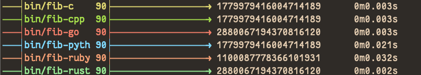

# Fibonacci in Four Compiled Languages

This is a quick repo that compares Fibonacci Sequence generations up to 100.

## High Level Languages

The languages included are:

* C(99)  (clang 17.0.0)
* C++23  (clang++ 17.0.0)
* Rust   (1.88.0)
* Go     (1.25.0)
* Python (3.13)
* Ruby   (3.4.4)

## Assembly

* MacOS arm64 Assemly: currently can not properly link it on MacOS arm64 architecture.

## Usage

To build the binaries, run:

```bash
./build
```

To run the resulting binaries, run:

```bash
./run
```

### Results

The following are the results of calculating Fibonacci numbers up to 90 on MacBook Pro (16-inch, Nov 2023) Apple M3 Max, 64GB RAM:


